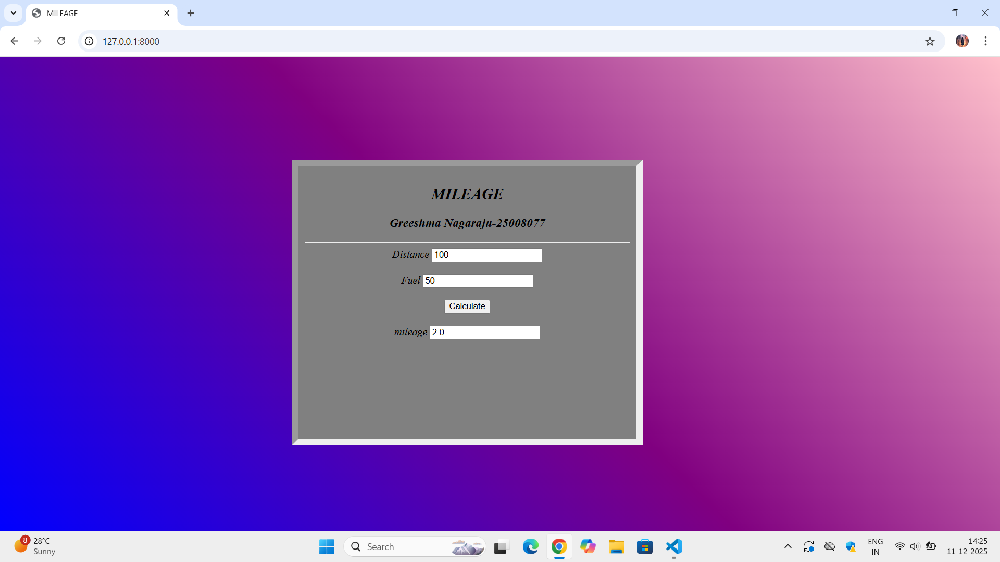

# Ex.04 Design a Website for Server Side Processing
## Date: 10-12-2025

## AIM:
To create a web page to calculate vehicle mileage and fuel efficiency using server-side scripts.

## FORMULA:
M = D / F
<br> M --> Mileage (in km/l)
<br> D --> Distance Travelled (in km)
<br> F --> Fuel Consumed (in l)

## DESIGN STEPS:
```
math.html

<html>
    <head>
        <title>
            MILEAGE
        </title>
        <style>
            body
            {
                background: linear-gradient(45deg,blue,purple,pink);
            }
            .box
            {
                width: 500;
                height: 400;
                border: inset 10px;
                position:fixed;
                background-color:grey;
                margin-top: 150px;
                margin-left:440px;
                padding: 10px;
            }
            h2
            {
                text-align: center;
            }
            h3
            {
                text-align: center;
            } 
        </style>
    </head>
    <body>
        <i>
            <div class="box">
            <h2>MILEAGE</h2>
            <h3>Greeshma Nagaraju-25008077</h3>
            <hr>
            <form method="POST" align="center">
                
                <label>Distance</label>
                <input type="number" name="distance" value="{{distance}}">
                <br>
                <br>
                <label>Fuel</label>
                <input type="number" name="fuel" value="{{fuel}}">
                <br>
                <br>
                <input type="submit" value="Calculate">
                <br>
                <br>
                <label>mileage</label>
                <input type="number" name="mileage" value="{{mileage}}">
            </form>
        </div>
        </i>
        

    </body>
</html>

views.py

from django.shortcuts import render
def mileage(request):
    distance = int(request.POST.get('distance', '0'))
    fuel = int(request.POST.get('fuel', '1'))
    mileage = distance/fuel if request.method == 'POST' else 0
    print("distance=",distance)
    print("fuel=",fuel)
    print("mileage=",mileage)
    return render(request, 'mathapp/math.html', {'distance': distance, 'fuel': fuel, 'mileage': mileage})

urls.py
from django.contrib import admin 
from django.urls import path  
from mathapp import views
urlpatterns = [path('', views.mileage, name='mileage')]

```

### Step 1:
Clone the repository from GitHub.

### Step 2:
Create Django Admin project.

### Step 3:
Create a New App under the Django Admin project.

### Step 4:
Create python programs for views and urls to perform server side processing.

### Step 5:
Create a HTML file to implement form based input and output.

### Step 6:
Publish the website in the given URL.

## PROGRAM:


## OUTPUT - SERVER SIDE:


## OUTPUT - WEBPAGE:



## RESULT:
The a web page to calculate vehicle mileage and fuel efficiency using server-side scripts is created successfully.
